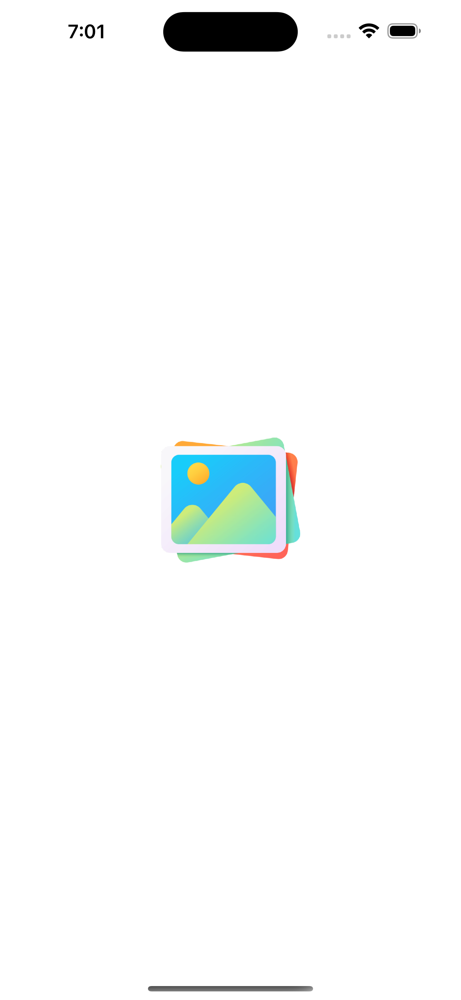
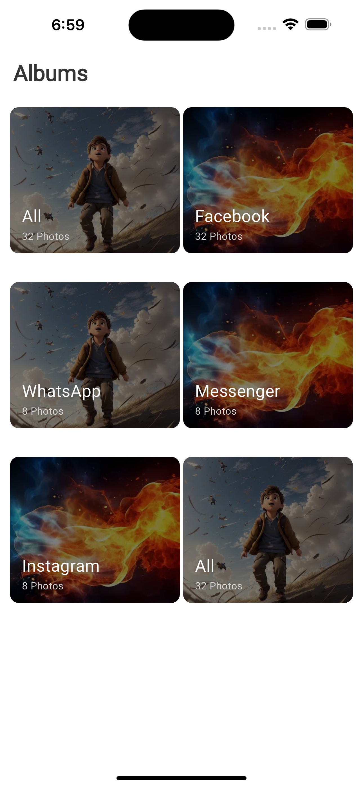

# About

A simple Flutter Gallery app that pull images from gallery using Bloc State Management.

#### Installation

In the command terminal, run the following commands:

    $ git clone https://github.com/enamulhaque028/gallery_app.git
    $ cd gallery_app
    $ flutter run

# Features 🎯

- Developed the application feature in alignment with the design provided via the <a href="https://www.figma.com/file/UP5tZX7tVxrAH6MF5nQT4m/Interview-Task?type=design&node-id=0%3A1&mode=design&t=vPqxKseb1qheH7Qc-1">Figma link</a>.
- Wrote custom code to fetch images directly from mobile devices, adhering to the requirement of avoiding third-party plugins/packages.
- Utilized the Bloc state management pattern to manage application state efficiently and maintain separation of concerns.
- Utilized a component-wise design pattern to promote code modularity and reusability
- Ensured compatibility of the application with both Android and iOS devices, providing a consistent user experience across platforms.

### Download

#### Get it on GitHub

<div>
<a href='https://github.com/enamulhaque028/gallery_app/releases/download/release_v1/gallery_v1.0.0.apk' target='_blank'></a>
</div>

#### Get it on Google Drive
<div>
<a href='https://drive.google.com/file/d/1aUG7tK08e-6wejtw4WdBNMed1fQSxAcG/view?usp=sharing' target='_blank'></a>
</div>


## Project Config Roadmap

All the necessary config and dependencies have already been set and ready for use but there is an explanation of each step if you want to know more about the pre-config or customize it.

Initialize the Flutter project, add all the necessary dependencies mentioned above in the **pubspec.yaml** configuration file and run `pub get`.

**pubspec.yaml**
```yaml
dependencies:
  flutter:
    sdk: flutter

  cupertino_icons: ^1.0.6
  permission_handler: ^10.2.0
  freezed_annotation:
  flutter_bloc: ^8.1.3

dev_dependencies:
  flutter_test:
    sdk: flutter

  flutter_lints: ^3.0.0
  build_runner:
  freezed:
  json_serializable:
```


#### Screenshots

<table>
    <tr>
        <td></td>
        <td></td>
    </tr>
    <tr>
        <td></td>
        <td></td>
    </tr>
</table>